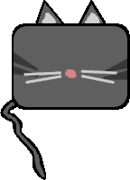

# The Bipolar Cat

> Made for Ludum Dare 32, "An unconditional weapon"

You (a cat :cat:) have been fully trained to bring happiness to human being. The world is in crisis and the only hope is **you**.  
But cats can be very selfish and evil sometimes... what about you? Will you save the world? Let it as is it? Or worse... destroy it?

You are an angel and a devil. You are the **Bipolar Cat**.  
Depending on how you interact with people the world will be directly affected.

Good luck.

  

**Note:**  
This was my first Ludum Dare.  
And also the first time I used Elm language.  
I learned a lot, it was a really fun week-end.  
But I was a little bit too ambitious on my ideas.  
I spent most of my time learning (or trying to understand) Elm.  

Functional + reactive are really nice and interesting for game dev though.  
I'm pretty sure that my next games architecture will be affected by this experience (even if I don't use Elm!).  
I really loved the clear seperation between : models, inputs, steps and views.  
It makes coding game logic a lot easier without mind blowing (compare to my previous game dev experiences) :)  

Next time I'll be more prepared!
